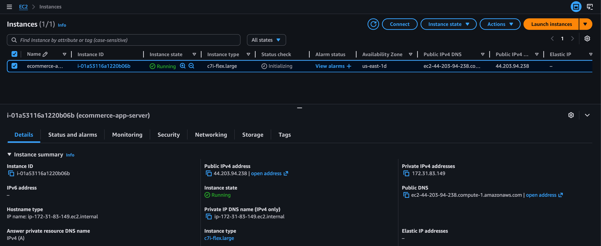
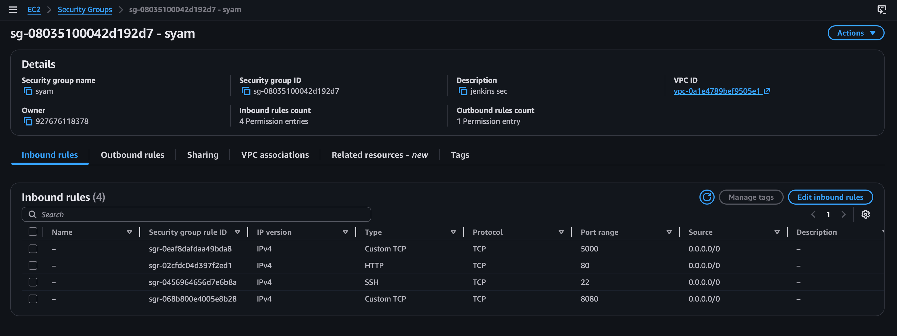
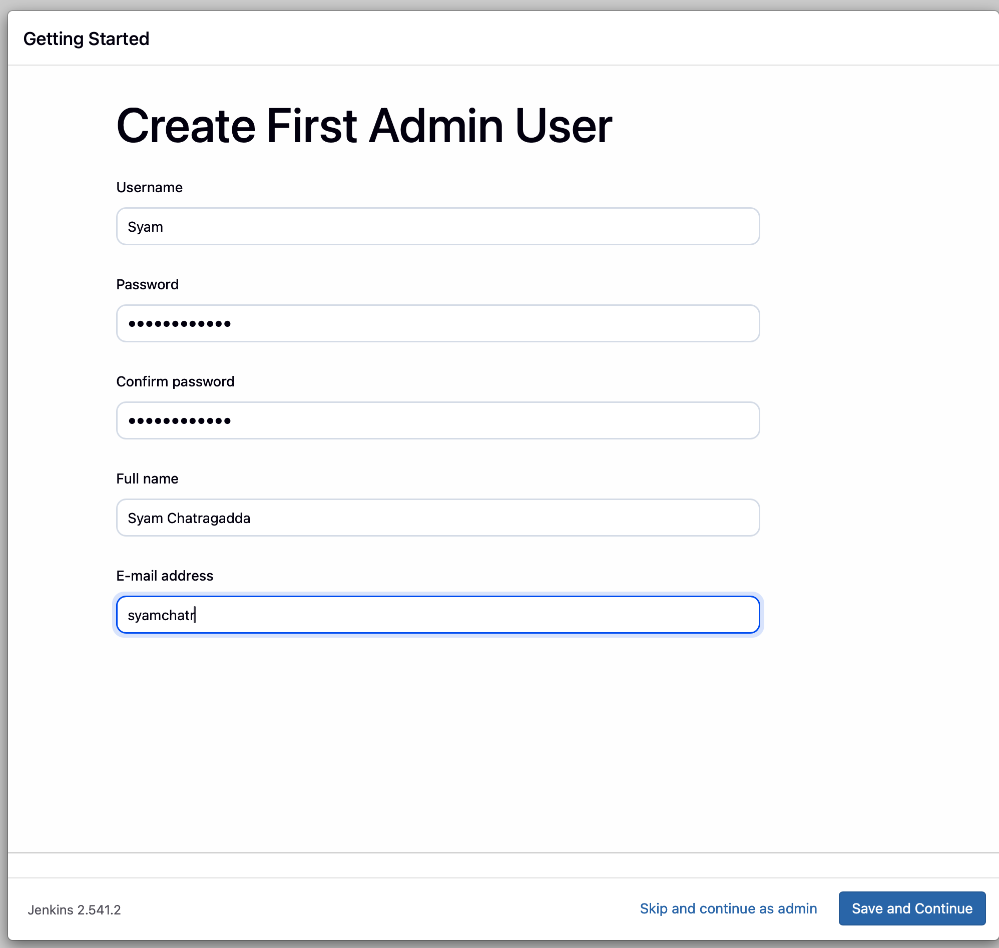
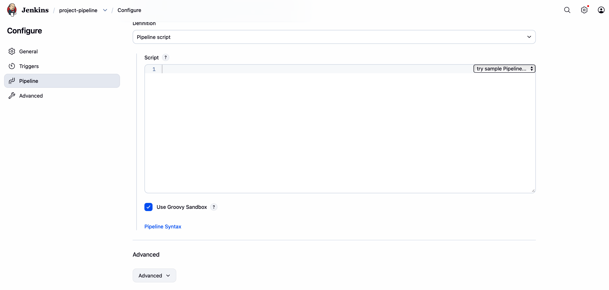

# 🛒 Ecommerce Project: Automated CI/CD Pipeline for Flask eCommerce App on AWS

---

## 📑 Table of Contents

- Project Overview  
- Architecture Diagram  
- Step 1: AWS EC2 Instance Preparation  
- Step 2: Install Dependencies on EC2  
- Step 3: Jenkins Installation and Setup  
- Step 4: GitHub Repository Configuration  
  - Dockerfile  
  - docker-compose.yml  
  - Jenkinsfile  
- Step 5: Jenkins Pipeline Creation and Execution  
- Conclusion  

---

## Project Overview

This document outlines the step-by-step process for deploying a containerized Flask-based eCommerce application (Flask + SQLite) on an AWS EC2 instance.

The deployment is containerized using Docker and Docker Compose. A full CI/CD pipeline is established using Jenkins to automate the build and deployment process whenever new code is pushed to a GitHub repository.

---

## Architecture Diagram

```
+-----------------+        +----------------------+        +-----------------------------+
| Developer       | -----> | GitHub Repo          | -----> | Jenkins Server              |
| (pushes code)   |        | (Source Code Mgmt)   |        | (Running on AWS EC2)        |
+-----------------+        +----------------------+        +-----------------------------+
                                                                |
                                                                | 1. Clones Repo
                                                                | 2. Builds Docker Image
                                                                | 3. Runs Docker Compose
                                                                v
                                              +--------------------------------------+
                                              | Application Server (AWS EC2)         |
                                              |--------------------------------------|
                                              | Docker Container: Flask              |
                                              | Gunicorn Server                      |
                                              | SQLite (store.db)                    |
                                              +--------------------------------------+
```

---

# Step 1: AWS EC2 Instance Preparation

### 1. Launch EC2 Instance

- Navigate to the AWS EC2 console.
- Launch a new instance using the **Amazon Linux 2023 (kernel-6.1)** AMI.
- Select the `c7i-flex.large` instance type.
- Create and assign a new key pair for SSH access.

---

### 2. Configure Security Group

Create inbound rules:

- SSH – TCP – Port 22 – Your IP  
- HTTP – TCP – Port 80 – 0.0.0.0/0  
- Custom TCP – Port 5000 (Flask) – 0.0.0.0/0  
- Custom TCP – Port 8080 (Jenkins) – 0.0.0.0/0  
 
---

### 3. Connect to EC2 Instance

```bash
ssh -i /path/to/key.pem ec2-user@<PUBLIC_IP>
```

---

# Step 2: Install Dependencies on EC2

## Install Git, Docker, and Docker Compose

```bash
sudo yum install git docker -y
```

Install Docker Compose:

```bash
sudo curl -L "https://github.com/docker/compose/releases/download/1.29.2/docker-compose-$(uname -s)-$(uname -m)" -o /usr/local/bin/docker-compose

sudo chmod +x /usr/local/bin/docker-compose
sudo ln -s /usr/local/bin/docker-compose /usr/bin/docker-compose

sudo yum install -y python3-pip
sudo pip3 install docker-compose
```

---

## Start and Enable Docker

```bash
sudo systemctl start docker
sudo systemctl enable docker
```

---

# Step 3: Jenkins Installation and Setup

## 1. Install Java

```bash
sudo yum install java-17-amazon-corretto -y
```

---

## 2. Add Jenkins Repository and Install

```bash
sudo wget -O /etc/yum.repos.d/jenkins.repo https://pkg.jenkins.io/rpm-stable/jenkins.repo

sudo yum install jenkins -y
```

---

## 3. Start and Enable Jenkins Service

```bash
sudo systemctl start jenkins
sudo systemctl enable jenkins
```

---

## 4. Initial Jenkins Setup

Retrieve the initial admin password:

```bash
cat /var/lib/jenkins/secrets/initialAdminPassword
```

Access Jenkins dashboard:

```
http://<PUBLIC_IP>:8080
```

- Paste password  
- Install suggested plugins  
- Create admin user  

---

## 5. Grant Jenkins Docker Permissions

```bash
sudo usermod -aG docker jenkins
sudo systemctl restart jenkins
```
 

---
# Step 4: GitHub Repository Configuration

Ensure your GitHub repository contains the following three files:

- Dockerfile  
- docker-compose.yml  
- Jenkinsfile  

---

## Dockerfile

```dockerfile
FROM python:3.11-slim

WORKDIR /app

COPY requirements.txt .

RUN pip install --no-cache-dir -r requirements.txt

COPY . .

EXPOSE 5000

CMD ["gunicorn", "-b", "0.0.0.0:5000", "app:app"]
```

---

## docker-compose.yml

```yaml
version: "3.8"

services:
  flask-app:
    build: .
    container_name: ecommerce-app
    ports:
      - "5000:5000"
    restart: always

```
---

## Jenkinsfile

```groovy
pipeline {
    agent any

    stages {
        stage('Code') {
            steps {
                git branch: 'ecommerce', url: 'https://github.com/chasya07/projects.git'
            }
        }

        stage('Build Docker Image') {
            steps {
                sh 'docker build -t ecommerce-app:latest .'
            }
        }

        stage('Deploy Application') {
            steps {
                sh 'docker-compose down || true'
                sh 'docker compose up -d --build'
            }
        }
    }
}
```

---

# Step 5: Jenkins Pipeline Creation and Execution

## Create a New Pipeline Job in Jenkins

- From the Jenkins dashboard, select **New Item**
- Name the project
- Choose **Pipeline**
- Click **OK**

---

## Configure the Pipeline

- Set Definition → **Pipeline script from SCM**
- Choose Git as the SCM
- Enter your GitHub repository URL
- Verify Script Path is `Jenkinsfile`
- Save configuration

---

## Run the Pipeline

Click **Build Now** to trigger the pipeline manually.

Monitor execution through:

- Stage View  
- Console Output  

---

## Verify Deployment

After successful build, access:

```
http://<PUBLIC_IP>:5000
```

Check running containers:

```bash
docker ps
```

---

# Conclusion

The CI/CD pipeline is now fully operational.

Any git push to the configured branch of the GitHub repository will automatically trigger the Jenkins pipeline, which will:

- Build the new Docker image  
- Deploy the updated application  

Ensuring a seamless and automated workflow from development to production.
